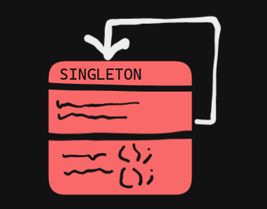

Un Singleton és un patrón (o mejor dicho antipatrón).

Cuando oímos la palabra patrón pensamos en algo repetitivo y complejo, pero anque el Singleton esté considerado un patron, realmente es todo lo contrario, un antipatrón simple y 'no recurrente'.
Esto es así porque se utiliza en entornos en los que queremos que solamente haya una instancia global de la clase con la que estamos trabajando, esto hace que sea un poco contradictorio llamarlo patrón. Pero bueno, la cuestión es que es útil y funcional.



### ¿Para qué querríamos una sola instacia?


Ejemplo de uso de un Singleton:
```java
public final class Singleton {

    private static Singleton INSTANCIA;
    private String info = "Atributos de la clase";
    
    private Singleton() {        
    }
    
    public static ClassSingleton getInstance() {

	//Si no tenemos ninguna instancia existente, creamos una.
        if(INSTANCIA == null) {
            INSTANCIA = new ClassSingleton();
        }
        return INSTANCIA;
    }

    // getters y setters.
}
```

